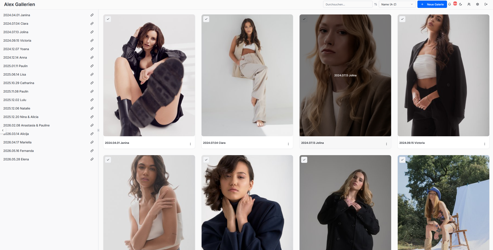
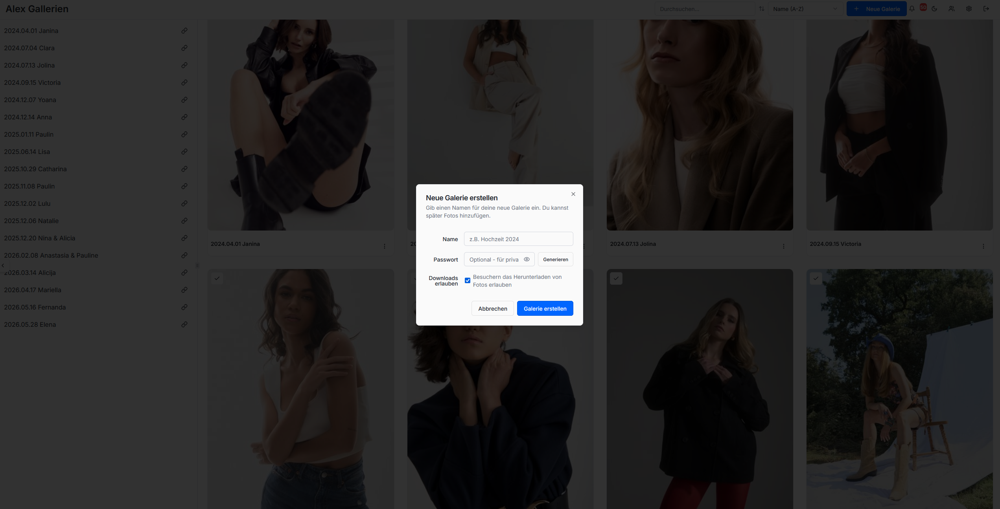
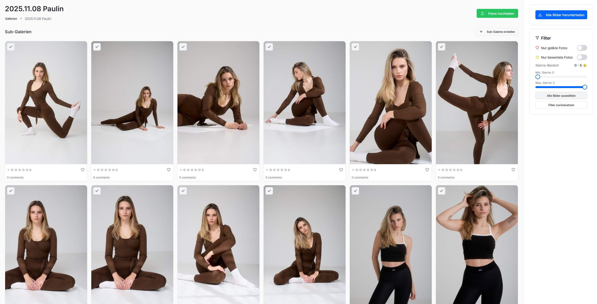
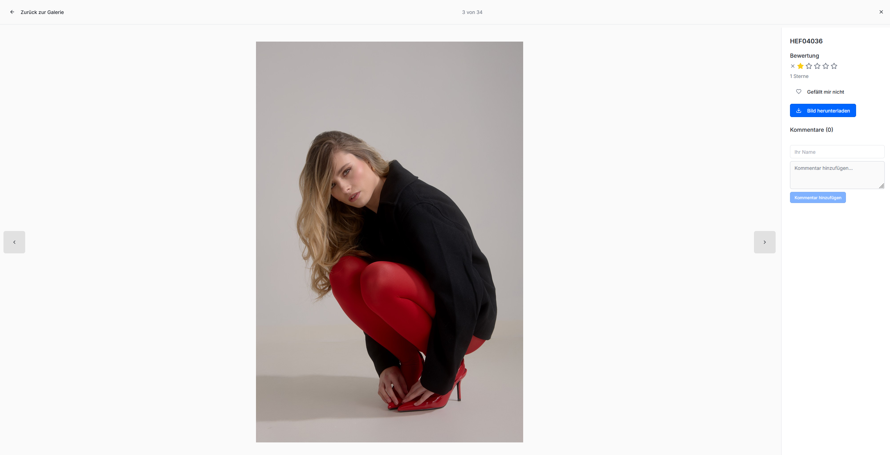
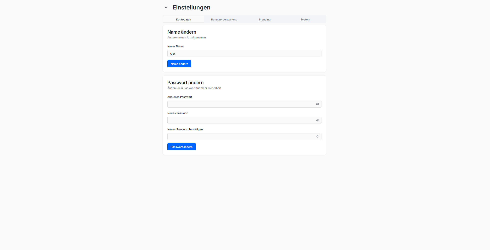

# 🖼️ FotoStube

**Self-hosted Client-Galerie & Fotografie-Portfolio** – Privatsphäre-freundliche Fotoübergabe an deine Kunden, ohne die Abhängigkeit von Drittanbieter-Clouds.

> FotoStube ist eine selbst gehostete Plattform, mit der Fotografen Galerien anlegen, Fotos hochladen und passwortgeschützt an Kunden freigeben können. Deine Daten bleiben auf deinem eigenen Server.

[](LICENSE)
[](https://www.docker.com/)
[](https://github.com/hefegraphie/FotoStube/pkgs/container/fotostube)
[](#)
[](#)

---

## 📸 Screenshots











## ✨ Features

- **Client-Galerien:** Galerien anlegen und einzelnen Kunden zuordnen
- **Passwortschutz:** Galerien gezielt per Passwort/URL für Kunden freigeben
- **Öffentliche Kundenansicht:** Elegante, responsive Galerie mit Lightbox
- **Sub-Galerien & Ordnung:** Fotos strukturieren und sortieren
- **Foto-Upload & Verwaltung:** Upload mit automatischer Thumbnail-Erstellung (Sharp)
- **Benutzerverwaltung:** Mehrere Nutzer/Rollen (Admin)
- **Benachrichtigungen:** Über Neuigkeiten informiert bleiben
- **Dunkel-/Hellmodus** (Theme-Toggle)
- **Self-hosted:** Läuft auf deinem eigenen Server – Daten bleiben bei dir
- **Docker-basiert** – einfache Installation & Updates

---

## 🧰 Tech-Stack

| Bereich | Technologie |
|---------|-------------|
| Frontend | React 18, TypeScript, Vite, Tailwind CSS, shadcn/ui (Radix) |
| Backend | Node.js, Express |
| Datenbank | PostgreSQL, Drizzle ORM |
| Auth | JWT (HttpOnly-Cookies) |
| Bildverarbeitung | Sharp |
| Deployment | Docker & Docker Compose |

---

## 🚀 Schnellstart

```bash
git clone https://github.com/hefegraphie/FotoStube.git
cd FotoStube
# → siehe „Installation & Start" unten für Docker- bzw. Bare-Metal-Setup
```

---

## 🔒 Wichtiger Hinweis: HTTPS (SSL) zwingend erforderlich

Um deine Daten bestmöglich zu schützen, setzt FotoStube auf strikte Sicherheitsstandards. Die Anmeldung und Sitzungsverwaltung erfolgt über sogenannte **JWT-Token**, die als streng gesicherte Cookies an deinen Browser gesendet werden.

**Das bedeutet:** Moderne Browser blockieren diese Cookies, wenn die Verbindung nicht verschlüsselt ist. Rufst du FotoStube über das Netzwerk oder Internet nur mit unverschlüsseltem `http://...` auf, wird der Login fehlschlagen und viele Funktionen der App bleiben gesperrt. **Dies ist ein gewolltes Sicherheitsfeature und kein Fehler!**

**Die Lösung:** Betreibe FotoStube immer hinter einem sogenannten **Reverse Proxy** (z. B. Nginx Proxy Manager, Traefik, Caddy oder Cloudflare Tunnels), der deine Domain mit einem gültigen SSL-Zertifikat (HTTPS) absichert.
*(Ausnahme: Lediglich beim reinen Testen direkt am eigenen PC über `http://localhost:5000` machen Browser oft eine Ausnahme).*

---

## Installation & Start

### Variante A: Docker Installation (Empfohlen)

Die Installation über Docker ist der einfachste und sauberste Weg, da keine direkten Systemeingriffe nötig sind. Bilder und Datenbank bleiben bei Updates erhalten.
*(Voraussetzung: Docker und Docker Compose sind auf dem System installiert)*

**1. Verzeichnis anlegen**
Erstelle einen neuen, leeren Ordner für FotoStube und wechsle dorthin:
```bash
mkdir fotostube
cd fotostube
```

**2. Passwörter festlegen (.env)**
Erstelle eine Datei für deine geheimen Passwörter:
```bash
nano .env
```
Füge folgenden Text ein und ersetze die Platzhalter durch eigene, sichere Werte:
```text
DB_PASS=dein_super_sicheres_passwort
JWT_SECRET=ein_sehr_langes_zufaelliges_geheimnis
```
*(Speichern & Schließen in nano: `Strg + O` -> `Enter` -> `Strg + X`)*

**3. Docker Compose Datei anlegen**
Erstelle die Bauanleitung für Docker:
```bash
nano docker-compose.yml
```
Kopiere diesen kompletten Block hinein:
```yaml
version: '3.8'

services:
  db:
    image: postgres:15-alpine
    restart: unless-stopped
    environment:
      POSTGRES_USER: hefe
      POSTGRES_PASSWORD: ${DB_PASS}
      POSTGRES_DB: fotostube
    volumes:
      - pgdata:/var/lib/postgresql/data
    healthcheck:
      test: ["CMD-SHELL", "pg_isready -U hefe -d fotostube"]
      interval: 5s
      timeout: 5s
      retries: 5

  app:
    image: ghcr.io/hefegraphie/fotostube:latest
    restart: unless-stopped
    ports:
      - "5000:5000"
    depends_on:
      db:
        condition: service_healthy
    environment:
      - DATABASE_URL=postgresql://hefe:${DB_PASS}@db:5432/fotostube
      - PORT=5000
      - NODE_ENV=production
      - JWT_SECRET=${JWT_SECRET}
    volumes:
      - ./logs:/app/logs
      - ./uploads:/app/uploads

volumes:
  pgdata:
```
*(Speichern & Schließen in nano: `Strg + O` -> `Enter` -> `Strg + X`)*

**4. FotoStube starten**
Lade das System herunter und starte es im Hintergrund:
```bash
docker-compose up -d
```

**Fertig!** FotoStube ist jetzt unter `http://<deine-server-ip>:5000` erreichbar. Deine Bilder werden automatisch in dem neuen Ordner `./uploads` gespeichert.

#### Upload-Ordner auf einen eigenen Pfad legen (Volume)

FotoStube speichert hochgeladene Bilder **immer** unter dem Ordner `/app/uploads` **innerhalb des Containers** — dieser Pfad ist fest im Code verdrahtet und sollte nicht geändert werden. Über den **Volume-Bereich** im `docker-compose.yml` legst du jedoch fest, **wo** dieser Ordner auf deinem Host-System tatsächlich landet.

Das funktioniert mit einem einfachen `Host-Pfad:/app/uploads`-Mount im Block `volumes:` des `app`-Dienstes:

```yaml
  app:
    image: ghcr.io/hefegraphie/fotostube:latest
    volumes:
      - /dein/eigener/pfad:/app/uploads   # links: Host-Pfad, rechts: Pfad im Container (fix)
```

**Ein paar Beispiele:**

| Zweck | Eintrag unter `volumes:` |
|-------|--------------------------|
| Standard (Ordner relativ im Projektverzeichnis) | `- ./uploads:/app/uploads` |
| Absoluter Pfad (z. B. eigene Festplatte) | `- /data/fotostube/uploads:/app/uploads` |
| NAS / Synology | `- /volume1/docker/fotostube/uploads:/app/uploads` |

Wichtig dabei:
- **Rechts vom Doppelpunkt bleibt immer `/app/uploads`** — das ist der Pfad, den die App intern verwendet.
- **Links vom Doppelpunkt** kannst du **beliebig** wählen — dort werden deine Bilder physisch gespeichert.
- Nach einer Änderung den Container neu erstellen: `docker-compose up -d`
- Einmal hochgeladene Bilder landen immer in dem Verzeichnis, das aktuell gemountet ist. Wechselst du den Pfad, bleiben die alten Bilder am alten Ort liegen — sie werden **nicht** automatisch umgezogen.

---

### FotoStube aktualisieren (Update)

Wichtig zu wissen: `docker-compose up -d` allein **zieht kein neues Image**. Wenn auf deinem System bereits eine Version liegt, nutzt Docker einfach die vorhandene. Für ein Update musst du das neue Image erst explizit holen.

**Standard-Weg (Schritt für Schritt):**
```bash
# 1. Neueste Version aus der Registry holen
docker-compose pull

# 2. Container mit der neuen Version neu starten
docker-compose up -d
```

**Oder als Einzeiler mit beidem:**
```bash
docker-compose pull && docker-compose up -d
```

**Oder kurz & automatisch (zieht vor jedem Start zwingend die neueste Version):**
```bash
docker-compose up -d --pull always
```

Beim Update bleibt alles Wichtige erhalten: Deine Bilder (`./uploads`), die Logs (`./logs`) und deine Datenbank (Volume `pgdata`) werden **nicht** angefasst – nur die FotoStube-App selbst wird ersetzt. Die Datenbank-Struktur wird beim Start automatisch an das neue Schema angepasst.

⚠️ **Achtung – Datenverlust vermeiden:** Nutze **niemals** `docker-compose down -v` für ein Update. Das `-v` löscht die Docker-Volumes und damit **komplett deine Datenbank und alle FotoStube-Daten unwiderruflich**.

---

### Variante B: Manuelle Installation (Bare-Metal, VPS oder LXC)

#### Ubuntu 22.04
```bash
apt update
```
```bash
apt install curl
```
```bash
curl -fsSL https://github.com/hefegraphie/FotoStube/raw/main/prodinstall.sh -o prodinstall.sh
chmod +x prodinstall.sh
sudo ./prodinstall.sh
```

#### Debian 13
```bash
apt update
```
```bash
apt install curl
```
```bash
curl -fsSL https://github.com/hefegraphie/FotoStube/raw/main/prodinstall.sh -o prodinstall.sh
chmod +x prodinstall.sh
./prodinstall.sh
```

Das Skript klont das FotoStube-Repo, installiert notwendige Pakete inklusive PostgreSQL, richtet die Datenbank ein, installiert Node.js Abhängigkeiten und fragt interaktiv nach Zugangsdaten.

#### Hinweise zur manuellen Installation
- Das Skript muss mit `sudo` bzw. als `root` ausgeführt werden.
- Während des Setups werden Eingaben für PostgreSQL Benutzername und Passwort abgefragt.
- Das Skript pausiert nach jedem einzelnen Schritt zur Überprüfung, mit `Enter` bestätigen um fortzufahren.

---

## 📄 Lizenz

FotoStube ist unter der **MIT-Lizenz** lizenziert – siehe [LICENSE](LICENSE).

---

# Wichtiger Disclaimer:
Große Teile des Programms wurden mit KI geschrieben aber von mir persönlich nach bestem Wissen und Gewissen getestet.
Ich nutze es nun schon seit 11.2025 produktiv.
